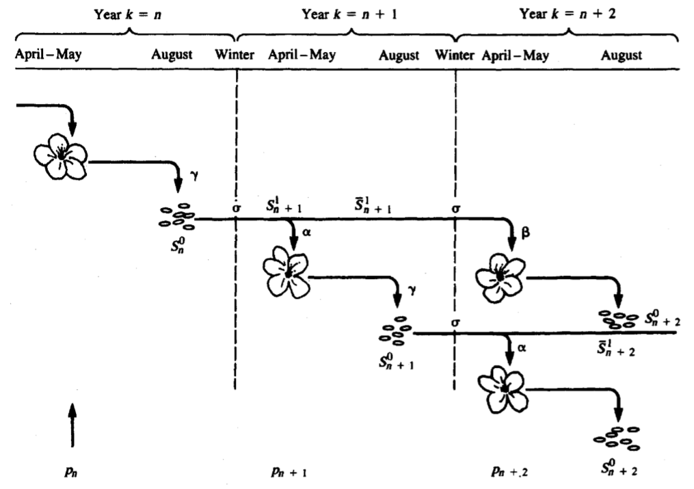

# Chapter 1. Linear Difference Equations

## Simple linear difference equations

A linear difference equation is an equation in the form of:

$$
x_n = \mathrm{F}(x_{n-1}, x_{n-2}, x_{n-3}, ...),
$$

where properties of $n$th term of x is dependent on the previous terms

Particularly, a simple linear difference equation is in the form of:
$$
x_n = \lambda x_{n-1}
$$

and will have a solution in the form of:
$$
x_n = \lambda^n x_0
$$
given $x_0$ as the initial condition

## Two examples of simple linear difference equatinos

### Example 1: Cell division

$M_n$: population of cells at time n

$a$: number of daughter cells generated per cell

$$
\begin{aligned}
M_{n+1} &= aM_n\\
&= a(aM_{n-1})\\
&= a^2 M_{n-1}\\
&= M_0 a^n
\end{aligned}
$$

### Example 2: Insect population

$$
\begin{aligned}
a_n &= \text{ adults(females)}\\
p_n &= \text{ kids(progeny)}\\
m &= \text{ mortality}\\
f &= \text{ average kids per female (productivity/fertility)}\\
r &= \text{ percentage female of adults}
\end{aligned}
$$

So we can have a couple of equations:

$$
\left\{
\begin{aligned}
p_{n+1} &= fa_n\\
a_{n+1} &= r(1-m)p_{n+1}
\end{aligned}
\right.
\Rightarrow a_{n+1} = \underset{constants}{[rf(1-m)]} a_n = [rf(1-m)]^{n+1}a_0
$$

---

## Higher-order linear difference equations

### Example 3: annual plants (second-order linear difference equations)

Life cycle of the annual plants:



Variables
$$
\begin{aligned}
\gamma &= \text{number of seeds per plant}\\
\alpha &= \text{percentage of 1 y/o seeds that sprout}\\
\beta &= \text{percentage of 2 y/o seeds that sprout}\\
\sigma &= \text{winter mortality}\\
\\
p_n &= \text{plant}\\
s_n^1 &= \text{seeds spring 1y/o}\\
s_n^2 &= \text{seeds spring 2y/o}\\
\overline{s_n^1} &= \text{seeds august (1y/o) (decided not to sprout)}\\
\overline{s_n^2} &= \text{seeds august (2y/o)}\\
s_n^0 &= \text{new seeds}
\end{aligned}
$$

Listing the equations:
$$
\left\{
\begin{aligned}
 &p_n = \alpha s_n^1 + \beta s_n^2 &(a)\\
 &\overline{s_n^1} = (1-\alpha)s_n^1 &(b)\\
 &\overline{s_n^2} = (1-\alpha)s_n^2 &(c)\\
 &s_n^0=\gamma p_n &(d)\\
 &s_{n+1}^1 = \sigma s_n^0 &(e)\\
 &s_{n+1}^2 = \sigma \overline{s_n^1} &(f)
\end{aligned}
\right.\\
\Downarrow\\
\begin{aligned}
&d\rightarrow e &s_{n+1}^1 &= \sigma\gamma p_n\\
&b\rightarrow f &s_{n+1}^2 &= \sigma (1-\alpha)s_n^1\\
\end{aligned}
$$

The solution would be:
$$
\left\{
\begin{aligned}
p_n &= \alpha\sigma\gamma p_{n-1}+\beta\sigma(1-\alpha)s_n^1\\
s_n^1 &= \sigma\gamma p_{n-1}
\end{aligned}
\right.
$$

Or further simplifying it:
$$
p_n = \alpha\sigma\gamma p_{n-1} + \beta\sigma^2(1-\alpha)\gamma p_{n-2}
$$

This is a **second-order linear difference equation**, where the term $x_n$ is described by the **2** terms before it ($x_{n-1}$ and $x_{n-2}$).

Here comes the introduction on how to solve higher-order linear difference equation.

---

### How to solve higher-order linear difference equations (normal)

Consider a general system of first-order difference equation
$$
\begin{aligned}
x_{n+1} &= a_{11} x_n + a_{12} y_n \rightarrow a_{12}y_n = x_{n+1} - a_{11} x_n&(1)\\
y_{n+1} &= a_{21} x_n + a_{22} y_n &(2)\\
\end{aligned}\\

\downarrow\\

\begin{aligned}
x_{n+2} &= a_{11} x_{n+1} + a_{12} \underline{(a_{21} x_n + a_{22} y_n)}
&\text{(plug in (2))}\\
&= a_{11} x_{n+1} + a_{12} a_{21} x_n + a_{12}a_{22}y_n\\
&= a_{11} x_{n+1} + a_{12} a_{21} x_n + a_{22} \underline{(x_{n+1} - a_{11}x_n)}
&\text{(plug in (1))}\\
&= (a_{11} + a_{22})x_{n+1} +
(a_{12}a_{21} - a_{22}a_{11})x_n
\end{aligned}\\
$$

It is known that the solution will be in the form of $x_n = \mathrm{C}\lambda^n$, then we can make substitution:
$$
\begin{aligned}
  &\mathrm{C}\lambda^{n+2} - \mathrm{C}(a_{11} + a_{22})\lambda^{n+1} + \mathrm{C}(a_{22}a_{11} - a_{12}a_{21})\lambda^n = 0\\
  &\lambda^2 - (a_{11} + a_{22})\lambda + (a_{22}a_{11} - a_{12}a_{21}) = 0\\
  &\lambda^2 - \beta\lambda + \gamma = 0
\end{aligned}\\
$$

where
$$
\left\{
\begin{aligned}
&\beta = a_{11} + a_{22}\\
&\gamma = a_{22}a_{11} - a_{12}a_{21}
\end{aligned}
\right.
$$

The equation
$$
\lambda^2 - \beta\lambda + \gamma = 0
$$
is termed as **characteristic equation**, and the solutions
$$
\lambda_1,\ \ \lambda_2 = \frac{\beta\pm\sqrt{\beta^2 - 4\gamma}}{2}
$$
are termed as **eigenvalues**.

Since the simplified equation is *linear*, the linear combinations of the $\lambda_1^n$ and $\lambda_2^n$ are also solutions to that equation (*principle of linear superposition*).

So the general solution would be:
$$
x_n = \mathrm{A}_1\lambda_1^n + \mathrm{A_2}\lambda_2^n,\ \ \forall \mathrm{A_1,A_2} \in \mathbb{R}
$$
where $A_1$ and $A_2$ are constants (not necessarily different). Given $x_0$ and $x_1$ (or any other terms) we can fix the value of $A_1$ and $A_2$.

If we eliminate $x$ instead of $y$, we'll get a similar result. It's a safe guess that the solution to the system of first-order linear equations should be in the form of:
$$
\left\{
\begin{aligned}
    x_n = \mathrm{A}_1\lambda_1^n + \mathrm{A_2}\lambda_2^n\\
    y_n = \mathrm{B_1} \lambda_1^n + \mathrm{B_2}\lambda_2^n
\end{aligned}
\right.
$$

Using linear algebra knowledge, we can show that the solution is indeed in this form.

---

### How to solve linear difference equations (linear algebra perspective)

A shorthand way of writing a system of linear equations:
$$
ax+by = 0\\
cx+dy = 0
$$

using vector notation is:
$$
Mv = 0
$$
where
$$
M = \left(
\begin{matrix}
    a & b \\
    c & d \\
\end{matrix}
\right)
\text{\     \ and \      \ }
\vec v =
\left(
\begin{matrix}
    x\\
    y
\end{matrix}
\right)\\
$$

We would like the system to have more than the trivial solution $\vec \textbf{v} = \left(
\begin{matrix}
    x\\
    y
\end{matrix}
\right)$. To achieve this, we can test **whether the determinant of $\mathrm{\textbf{M}}$** is zero; i.e.,
$$
\mathrm{det\textbf{M}} = ad-bc = 0
$$

If the determinant is zero, it means that the equations contain the same information (i.e. we can derive that $x = -by/a$). This either means there's no solution or there're infinitely many solutions to the system of equations.

Apply the linear algebraic view to solve the more general linear system. The basic idea is we can simplify the system to the form of having zero on the right hand side.

The general system we used above
$$
x_{n+1} = a_{11} x_n + a_{12} y_n = ax_n + by_n\\
y_{n+1} = a_{21} x_n + a_{22} y_n = cx_n + dy_n\\
$$
can be written in the form of:
$$
\vec\textbf{v}_{n+1} = \textbf{M}\vec\textbf{v}_{n}
$$

We know that the solutions to the system will look like
$$
\vec\textbf{v}_n = \left(
\begin{matrix}
A\lambda^n\\B\lambda^n
\end{matrix}
\right) = \lambda^n \left(
\begin{matrix}
A\\
B
\end{matrix}
\right)
$$

Perform substitution, we'll get
$$
\left(
\begin{matrix}
    \lambda^{n+1}A\\
    \lambda^{n+1}B
\end{matrix}
\right)
= M \lambda^n
\left(
\begin{matrix}
    A\\B
\end{matrix}
\right)\\

\left(
\begin{matrix}
    \lambda A\\
    \lambda B
\end{matrix}
\right)
= M
\left(
\begin{matrix}
    A\\
    B
\end{matrix}
\right)
$$
Expand the simplified system of equations notation, we can see
$$
\begin{aligned}
    \lambda A = aA + bB\\
    \lambda B = cA + dB
\end{aligned}
\\
\Downarrow
\\
\begin{aligned}
    (a-\lambda)A + bB = 0\\
    cA + (d-\lambda)B = 0
\end{aligned}
$$

This is equivalent to
$$
\left(
\begin{matrix}
a-\lambda & b\\
a & d - \lambda
\end{matrix}
\right)
\left(
    \begin{matrix}
        A\\B
    \end{matrix}
\right) = 0
$$

To have nonzero solutions for $A$ and $B$, we would like to make the determinant of that matrix equal to zero:
$$
\mathrm{det}\textbf{M} = \mathrm{det} \left(
\begin{matrix}
a-\lambda & b\\
a & d - \lambda
\end{matrix}
\right)
$$
This leads to
$$
\begin{aligned}
    (a - \lambda)(d - \lambda) - bc = 0\\
    \lambda^2 -(a + d)\lambda + ad - bc = 0\\
    \lambda^2 - \beta\lambda + \gamma = 0
\end{aligned}
$$

where
$$
\left\{
\begin{aligned}
&\beta = a + d = a_{11} + a_{22}\\
&\gamma = ad - bc = a_{11}a_{22} - a_{12}a_{21}
\end{aligned}
\right.
$$

discriminant: $\beta^2 - 4\gamma$

> ### Special meanings of $\beta$, $\gamma$ and $\beta^2 - 4\gamma$ in linear algebra
>
> $\beta = a_{11} + a_{22} = \mathrm{Tr}\textbf{M} =$ the *trace* of matrix $\textbf{M}$
>
> $\gamma = a_{11}a_{22} - a_{12}a_{21} = \mathrm{det}\textbf{M} =$ the *determinant* of $\textbf{M}$
>
> $\beta^2 - 4\gamma = \mathrm{disc}(\textbf{M}) =$ the *discriminant* of $\textbf{M}$

---

### Solve the system of difference equations using the methods introduced above

Question to answer: will the plant be successful?

To simplify the notation, let $a = \alpha\sigma\gamma$ and $b = \beta\sigma^2(1-\alpha)\gamma$.

We'll have:
$$
    p_{n+1} - a p - b p_{n-1} = 0
$$
which corresponds to the characteristic equation
$$
    \lambda^2 -a\lambda - b = 0
$$

Solve the quadratic equation, we gan get that
$$
\begin{aligned}
    \lambda &= \frac{a \pm \sqrt{a^2 + 4b}}{2}\\
    \lambda &= \frac{(\alpha\sigma\gamma) \pm \sqrt{(\alpha\sigma\gamma)^2 + 4(\beta\sigma^2-\beta\sigma^2\alpha)\gamma)}}{2}\\
    \lambda &=
    \frac{\alpha\sigma\gamma}{2} \pm
    \frac{\sqrt{(\alpha\sigma\gamma)^2(1 + 4(\frac{\beta\sigma}{\alpha^2\gamma}-\frac{\beta\sigma}{\alpha\gamma}))}}{2}
\end{aligned}
$$
We can write the overcomplicated full solution in this form
$$
\boxed{
    \lambda = \frac{\alpha\sigma\gamma}{2}(1 \pm \sqrt{1 + \delta})
}
$$

where
$$
\begin{aligned}
    \delta &= 4(\frac{\beta\sigma}{\alpha^2\gamma} - \frac{\beta\sigma}{\alpha\gamma})\\
    &=\frac{4}{\gamma} \frac{\beta}{\alpha} (\frac{1}{\alpha} - 1)\\
\end{aligned}
$$

Since we know that $\alpha$ cannot be larger than 1, $\delta$ is a positive quantity.

Simple assumption: $\beta = 0$, which means few two-year-old seeds germinate.
Then $\lambda = \alpha\sigma\gamma, \ \ 0$ and $p_n = c_1 (\sigma\gamma\alpha)^n + c_2$. (Note that $0^n$ is $1$)(?)

This is also the "lower-bound" of the positive eigenvalue $\lambda$. Therefore, to en sure propagation, we need:
$$
\lambda > 1,\   \ \alpha\sigma\gamma > 1, \    \ \gamma > 1/\sigma\alpha
$$
i.e., the number of seeds produced per plant should be greater than $1/\sigma\alpha$.

Under the assumption that $\beta = 0$, it means that the parent plant can only be
assured of replacing it self if it gives rise to at least *one* germinated seed.

If $\beta$ is not negligibly small, then we'll solve for this
$$
\gamma > \frac{1}{\alpha\sigma + \beta\sigma^2 (1-\alpha)}
$$

---

## Complex eigenvalues

> ### Brief intro to complex number
>
> $$i^2 = -1$$
>
> Computing principle:
> $$
    \begin{aligned}
        &(a_1+b_1i) + (a_2 + b_2i) = (a_1 + a_2) + (b_1 + b_2) i\\
        &(a_1 + b_1 i)(a_2 + b_2i) = a_1a_2 + a_2b_1 i \sout{ (+ b_1b_2i^2)} -b_1b_2
    \end{aligned}$$
> Modulus / norm / absolute value:
> $$|a+bi|^2 = a^2 + b^2$$
>
>
> #### Polar form Euler's identity
>
> $$z ( = \lambda) = a+bi = r e^{i\theta} = r(\cos{\theta} + i \sin{\theta})$$
> $$\lambda_1\lambda_2 = (r_1e^{i\theta_1})(r_2e^{i\theta_2})$$
>
> #### Conjugate
>
> $$\bar z = a - bi$$
>
> #### Power of a complex number
>
> $$z^n = r^n(\cos{n\theta} + i\sin{n\theta})$$

```latex {cmd=true,hide=true}
\documentclass{article}
\begin{document}
test tex input
\end{document}
```
